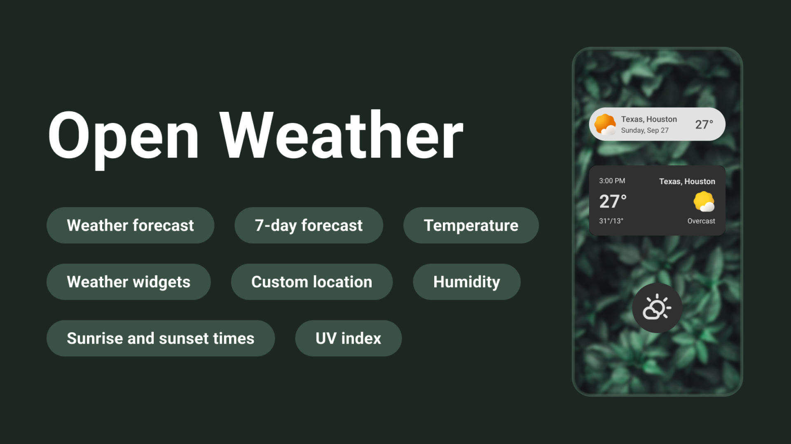

 
 

 

# Open Weather

## Overview
Open Weather is a simple and intuitive Android application that provides users with real-time weather information, including a 7-day forecast, temperature, humidity, UV index, sunrise and sunset times, and more. Users can select their location or allow the app to detect their location via GPS. The app also includes customizable widgets for easy access to weather updates directly on the home screen.

## Features
- 7-Day Weather Forecast: Stay updated with a detailed forecast for the upcoming week.
- Custom Location: Select a location or use the device's GPS to automatically detect your position.
- Real-Time Temperature: Get the current temperature for your selected location.
- Weather Widgets: Access weather updates right from your home screen.
- Humidity: View current humidity levels.
- Sunrise and Sunset: Check the exact times for sunrise and sunset.
- UV Index: Stay safe with UV index information.

## API Usage
This app uses the Open-Meteo API for fetching location-based weather data. The Open-Meteo API provides accurate weather data for free, without the need for an API key. This ensures a seamless experience for users without any complex setup.

https://open-meteo.com/

### Key Points:
- Location Data: The app retrieves the device's GPS coordinates and uses them to request location-specific weather information.
- Weather Forecast: Weather information and forecasts are fetched via the Open-Meteo API based on the provided coordinates.